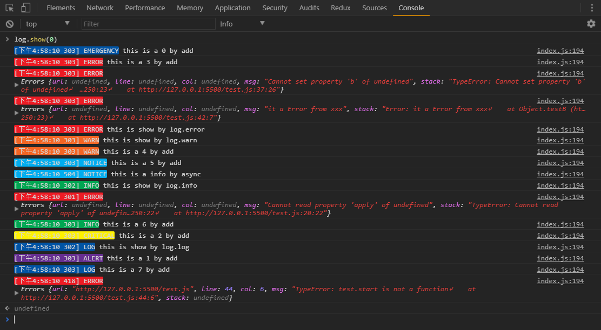

PS E:\git\TechCloud\xlog> jsdoc2md index.js
<a name="XLog"></a>

## Example


## XLog
**Kind**: global class

* [XLog](#XLog)
    * [new XLog(opt)](#new_XLog_new)
    * _instance_
        * [.init()](#XLog+init)
        * [.size()](#XLog+size)
        * [.add(level, loginfo)](#XLog+add)
        * [.get(level)](#XLog+get) ⇒ <code>object</code>
        * [.set(level)](#XLog+set)
        * [.show(level, opt)](#XLog+show)
        * [.reset(level)](#XLog+reset)
        * [.catch(f)](#XLog+catch) ⇒ <code>function</code>
        * [.catchModule(m)](#XLog+catchModule)
    * _static_
        * [.LOG](#XLog.LOG) : <code>enum</code>

<a name="new_XLog_new"></a>

### new XLog(opt)
create a XLog instance


| Param | Type | Default | Description |
| --- | --- | --- | --- |
| opt | <code>object</code> |  | arguments object |
| [opt.level] | <code>number</code> | <code>3</code> | log level [LOG.LEVEL](LOG.LEVEL) |
| [opt.mode] | <code>string</code> | <code>&quot;DEV&quot;</code> | DEV OR PROD |
| [opt.send] | <code>function</code> | <code>function(){}</code> | if u need to send log to remote, u need to define send function |

<a name="XLog+init"></a>

### xLog.init()
init reset XLog data

**Kind**: instance method of [<code>XLog</code>](#XLog)
<a name="XLog+size"></a>

### xLog.size()
Get the size of all local log

**Kind**: instance method of [<code>XLog</code>](#XLog)
<a name="XLog+add"></a>

### xLog.add(level, loginfo)
add a log to log data

**Kind**: instance method of [<code>XLog</code>](#XLog)

| Param | Type | Description |
| --- | --- | --- |
| level | <code>number</code> | the level of log item |
| loginfo | <code>any</code> |  |

<a name="XLog+get"></a>

### xLog.get(level) ⇒ <code>object</code>
Get the log data by `level`

**Kind**: instance method of [<code>XLog</code>](#XLog)
**Returns**: <code>object</code> - XLog.data

| Param | Type | Description |
| --- | --- | --- |
| level | <code>number</code> | the level of log item |

<a name="XLog+set"></a>

### xLog.set(level)
set log level, just show log below level number

**Kind**: instance method of [<code>XLog</code>](#XLog)

| Param | Type | Description |
| --- | --- | --- |
| level | <code>number</code> | the level of log item |

<a name="XLog+show"></a>

### xLog.show(level, opt)
Show All XLogs 显示所有日志信息

**Kind**: instance method of [<code>XLog</code>](#XLog)

| Param | Type | Default | Description |
| --- | --- | --- | --- |
| level | <code>number</code> |  | the level of log item |
| opt | <code>object</code> |  |  |
| [opt.sort] | <code>string</code> | <code>&quot;&#x27;time&#x27;&quot;</code> | time or type- show log by time sorted |
| [opt.only] | <code>boolean</code> | <code>false</code> | just show level number only |

<a name="XLog+reset"></a>

### xLog.reset(level)
重置所有日志内容

**Kind**: instance method of [<code>XLog</code>](#XLog)

| Param | Type | Description |
| --- | --- | --- |
| level | <code>number</code> | the level of log item |

<a name="XLog+catch"></a>

### xLog.catch(f) ⇒ <code>function</code>
decorate function f with try catch wrapper

**Kind**: instance method of [<code>XLog</code>](#XLog)
**Returns**: <code>function</code> - f - return try catch wrappered f

| Param | Type |
| --- | --- |
| f | <code>function</code> |

<a name="XLog+catchModule"></a>

### xLog.catchModule(m)
decorate every function of module m with try catch wrapper

**Kind**: instance method of [<code>XLog</code>](#XLog)

| Param | Type | Description |
| --- | --- | --- |
| m | <code>object</code> | module with functions |

<a name="XLog.LOG"></a>

### XLog.LOG : <code>enum</code>
XLog.LOG.LEVELHE LOG

**Kind**: static enum of [<code>XLog</code>](#XLog)
**Example**
```js
0: 'EMERGENCY',  //system unusable
1: 'ALERT',      //immediate action required
2: 'CRITICAL',   //condition critical
3: 'ERROR',      //condition error
4: 'WARN',       //condition warning
5: 'NOTICE',     //condition normal, but significant
6: 'INFO',       //a purely informational message
7: 'LOG'         // LOG or debugging information
```